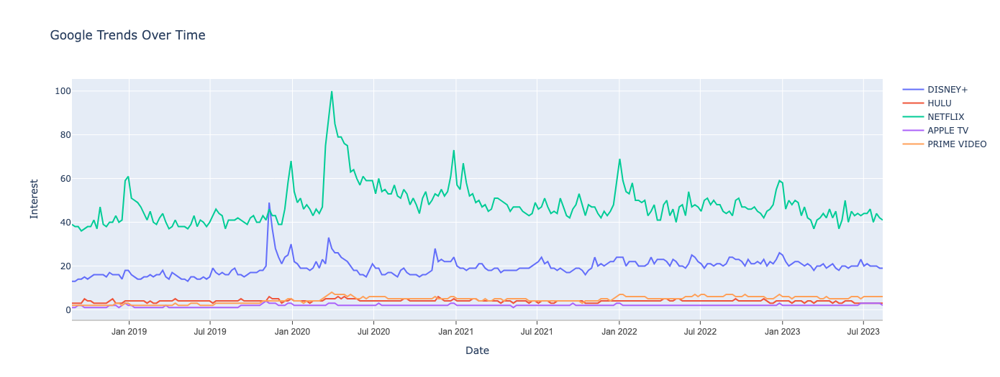
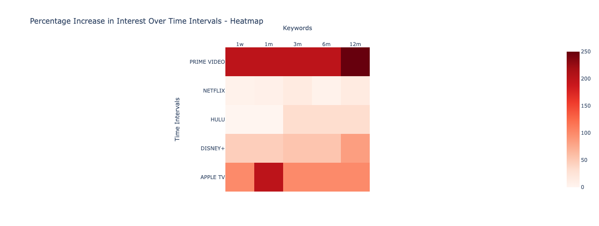
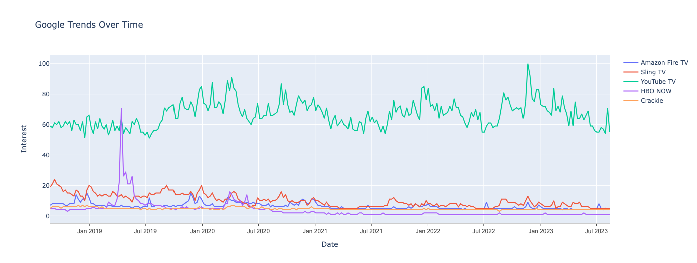
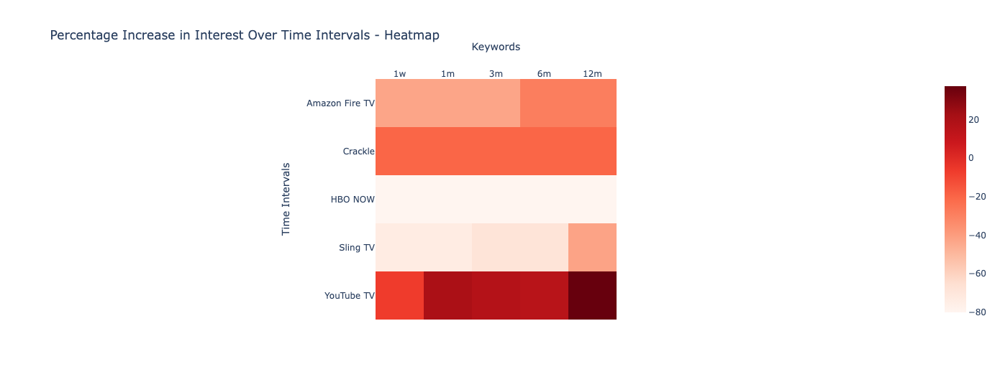

# TRENDSCAPE 
###### [click here for + ai](#Trendscape-Ai)
## Google Trends Analysis

This document outlines a Python script designed to analyze Google Trends data. The script employs various libraries to offer insights into the trends and popularity of user-specified keywords within a defined time frame. Here's a breakdown of the script's functionality:

## Table of Contents
- [Libraries](#libraries)
- [Google Trends Setup](#google-trends-setup)
- [User Input](#user-input)
- [Fetching Data](#fetching-data)
- [Plotting Trends](#plotting-trends)
- [Percentage Changes](#percentage-changes)
- [Results](#results)

## Libraries <a name="libraries"></a>
The script starts by importing essential libraries: `TrendReq` from `pytrends.request`, `matplotlib.pyplot`, `pandas`, and `plotly.graph_objects`.

## Google Trends Setup <a name="google-trends-setup"></a>
The Google Trends API is initialized with parameters like language (`hl`), time zone (`tz`), and other settings.

## User Input <a name="user-input"></a>
The script prompts users to input the number of keywords they want to analyze (up to 25) and collects these keywords in a list.

## Fetching Data <a name="fetching-data"></a>
Using the provided keywords, the script builds a payload and retrieves Google Trends data for the last 5 years (`timeframe='today 5-y'`) without geographical or property filters.

## Plotting Trends <a name="plotting-trends"></a>
The `plot_interest_over_time` function utilizes `plotly.graph_objects` to create a line chart. This chart visualizes the interest levels of each keyword over time.
- 
- 


## Percentage Changes <a name="percentage-changes"></a>
The script calculates the percentage change in interest for each keyword over various time intervals (`1w`, `1m`, `3m`, `6m`, `12m`). It compares initial and final interest levels within each interval.

## Results <a name="results"></a>
The script displays the percentage change DataFrame, illustrating interest level fluctuations across selected time intervals. Additionally, it identifies the keyword with the highest interest.

To run the script, ensure the required libraries are installed. Upon execution, input desired keywords when prompted to gain insights into Google Trends data and keyword popularity trends.

---
---
---

# Trendscape Ai
Using ChatGPI

## Description
TrendScape+AI is a tool that fetches Google Trends data for user-inputted keywords and provides AI-powered recommendations for related terms using ChatGPT.

## Features
- User prompts for keyword input.
- Uses ChatGPT to get semantically related term recommendations.
- Fetches and visualizes Google Trends data for the past 5 years based on the provided keywords.

## Requirements
- Python 3.6 or later.
- Libraries: `pytrends`, `matplotlib`, `pandas`, `plotly`, and `requests`.
- API key from OpenAi

## Setup & Installation
1. Clone this repository: `git clone <repository-url>` / Open In Collab
2. Navigate to the project directory: `cd TrendScape+AI`
3. Install required libraries: `pip install pytrends matplotlib pandas plotly requests`

## Usage
1. Run the script: `python trendscape+ai.py` / `jupter notebook` / Google collab
2. Enter the desired keyword when prompted.
3. Review the recommended related terms and choose any additional terms.
4. View the Google Trends data visualization for the selected terms.

## Ai implementations & Analysis

Starting from the initial inquiry, Chat GPT will search related terms and continue the analysis
- 


  Change in interest (%) in the following intervals 

|         | 1w         | 1m         | 3m         | 6m         | 12m        |
|---------|------------|------------|------------|------------|------------|
| APPLE TV| 100.0      | 200.0      | 100.0      | 100.0      | 100.0      |
| DISNEY+ | 46.153846  | 46.153846  | 53.846154  | 53.846154  | 84.615385  |
| HULU    | 0.0        | 0.0        | 33.333333  | 33.333333  | 33.333333  |
| NETFLIX | 5.128205   | 7.692308   | 15.384615  | 5.128205   | 15.384615  |
| PRIME VIDEO| 200.0    | 200.0      | 200.0      | 200.0      | 250.0      |

Print highest interest to view 
```python PRINT(highest_interest)```
|            | Count |
|------------|-------|
| DISNEY+    | 52    |
| HULU       | 7     |
| NETFLIX    | 100   |
| APPLE TV   | 4     |
| PRIME VIDEO| 8     |
- 

  
Chat GPT returns
Related Terms:
- Amazon Fire TV
- Sling TV
- YouTube TV
- HBO NOW
- Crackle

New Analysis

- 


  Change in interest (%) in the following intervals 

|             | 1w         | 1m         | 3m         | 6m         | 12m        |
|-------------|------------|------------|------------|------------|------------|
| Amazon Fire TV | -42.857143 | -42.857143 | -42.857143 | -28.571429 | -28.571429 |
| Crackle     | -20.0      | -20.0      | -20.0      | -20.0      | -20.0      |
| HBO NOW     | -80.0      | -80.0      | -80.0      | -80.0      | -80.0      |
| Sling TV    | -73.684211 | -73.684211 | -68.421053 | -68.421053 | -42.105263 |
| YouTube TV  | -6.779661  | 20.338983  | 16.949153  | 15.254237  | 37.288136  |

-Print highest interest :
|             | Interest |
|-------------|----------|
| Amazon Fire TV | 15      |
| Sling TV    | 24       |
| YouTube TV  | 100      |
| HBO NOW     | 71       |
| Crackle     | 7        |

- 

## API Integration
This tool integrates with the OpenAI API to get recommendations from ChatGPT. Ensure you have a valid OpenAI API key and be aware of potential associated costs.

## License
[Specify licensing details or mention "MIT License"]


